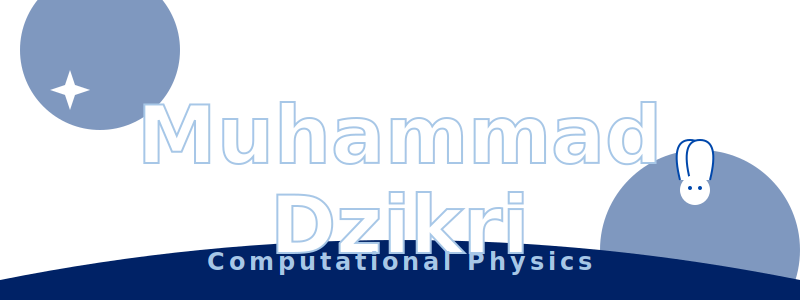

  

<h2 align="center">
   
  ★ WELCOME TO MY UNIVERSE ★ 
  
</h2>

> ❝ **Science and technology can bridge reasoning and faith.** ❞

---

### 💿 NOW PLAYING: [AstroHijri Pro](https://github.com/painfulbykisses/AstroHijri-Pro)

  
   
  

---

### 🛠️ TECH STACK

  
  
  
  
  
  
  

---

### 📊 STATS & STREAKS

  <!-- GitHub Stats: Tokyonight-duo theme is close to blue/purple vibe -->
  
  

 

  <!-- Snake Game -->
  

---

### 👾 CONNECT

  
  
  

  <small>★ Designed with Y2K Aesthetic by @painfulbykisses ★</small>

